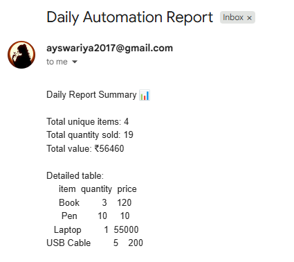
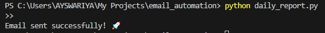

# Daily Email Automation Script (Python)

This project automatically reads a CSV file, generates a summary report, and emails it using Python.

## Features
- Reads CSV data
- Calculates totals & value
- Creates a daily summary
- Sends automated email
- Easy to customize for clients

## Technologies Used
- Python
- Pandas
- smtplib
- MIME (email module)
- JSON config file

## How to Run
1. Install dependencies:
   pip install pandas

2. Add your Gmail + app password inside config.json

3. Add your dataset inside data.csv

4. Run:
   python daily_report.py

## SCREENSHOTS

